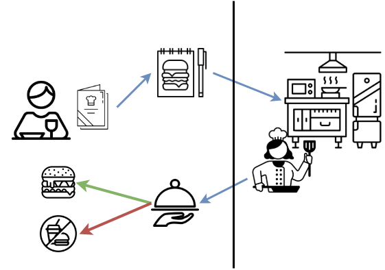
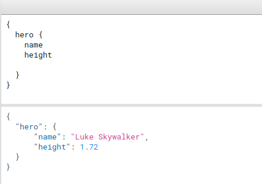

# What is an API?

API stands for **Application Programming Interface**.  APIs are the glue that hold the technology universe together.  They are a communication tool that can be used to pass information to and from different kinds of devices and hardware through requests and responses.  

There are APIs that can be used over the web, directly between local devices, or just between different code all on your computer.  It can be written in any language, and may use a number of protocols.  All that sounds very nebulous.  But at the heart of it, APIs are that versatile.  It's the specific implementations that do particular things that narrow the scope. Before we get down to the details, let's look at a restaurant concept example.

> ### Concept: Restaurant as an API
> * You request an item listed the menu.  
> * Your order is received by the kitchen.
> * The kitchen performs all kinds of operations needed to make your food.
> * Then then you get a response.  Your food is either delivered to your table or you get no food if they couldn't make your request. They can't make your food if you ordered something that isn't on the menu, you didn't ask for it correctly, or if equipment failure prevented them from making your requested item.
>
> API requests have to be made in specific ways so **referring to Documentation** is very important.
{: .callout}

APIs provide an abstraction layer that spares you the details of a database or server implementation when all you want is to work with information.  For example, say you want the latest red sox scores.  You don't want to know how MLB stores that information in their database, what kind of database it is, or how it is managed.  You just want the information.  In fact, [MLB API](https://appac.github.io/mlb-data-api-docs/) probably doesn't want you mucking around in their database to begin with!  

And for APIs that do want you to provide data to them (e.g. [Twitter's API](https://developer.twitter.com/en/docs/twitter-api)), they can require authentication and put limitations on use like limiting the rate you can hit the API.

> Tip: **Finding APIs**. With so many APIs out there how do you find what you are looking for? It is sometimes as easy as a web search using "API" in your keywords.  But there are other resources too like [ProgrammableWeb's API Directory](https://www.programmableweb.com/category/all/apis).

The web made up of APIs.  In fact, every time you look at a web page you are making a request to a server and you are getting back HTML content displayed to you in your web client (e.g. Chrome, Firefox).  An API isn’t the same as the remote server, it is the part of the server that receives requests and sends responses.

In this workshop we will be focusing on web APIs that involve making requests and responses over the internet using HTTP.

## APIs are more than just the "web"

But APIs are not just for the web!  APIs to communicate with device hardware is also very common.  

If you are a mobile app developer you use APIs all the time to communicate with hardware like the camera, gps, etc. But also, APIs can accelerate development time and make your code simpler by provide helper code.  

For example, if developing a camera app you don't want to write a click handler or the intricacies of the camera hardware. You just want to write code that takes a picture and automatically adds funny emojis to it when you press that button. 
e.g. existing code "android:onClick" and the Android Camera API [https://developer.android.com/guide/topics/media/camera](https://developer.android.com/guide/topics/media/camera)

Libraries and Frameworks can also be APIs that provide helper code for other code.

## Simple API

~~~
$ curl http://numbersapi.com/42
~~~
{: .language-bash}

~~~
42 is the number of laws of cricket.
~~~
{: .output}

[Numbers API](https://numbersapi.com/#42) provides facts about numbers. By putting the number of
interest into the address, we tell Numbers API which number to give a fact
about. 

# Types of APIs

## REST

REST stands for **REpresentational State Transfer**.  REST is a set of guidelines on how to architect a network-connected software system.  It is not a specification. 

An API can be called a "REST API" if it conforms to the REST architectural style. 

A REST API is a medium for two computers to communicate over HTTP (Hypertext Transfer Protocol), in the same way clients and servers communicate.

REST Constraints:

1. Uniform interface
2. Client–server
3. Stateless (the server does not store any information about your session)
4. Cacheable
5. Layered system
6. Code on demand (optional)

More on constraints: 
* [https://restfulapi.net/rest-architectural-constraints/](https://restfulapi.net/rest-architectural-constraints/)

More about RESTful design at: 
* [https://restfulapi.net/rest-api-design-tutorial-with-example/](https://restfulapi.net/rest-api-design-tutorial-with-example/)
* [https://frontend.turing.edu/lessons/module-3/rest-architecture-and-urls.html](https://frontend.turing.edu/lessons/module-3/rest-architecture-and-urls.html)
* [https://www.freecodecamp.org/news/rest-api-best-practices-rest-endpoint-design-examples/](https://www.freecodecamp.org/news/rest-api-best-practices-rest-endpoint-design-examples/)
* [Roy Thomas Fielding's Dissertation](https://www.ics.uci.edu/~fielding/pubs/dissertation/top.htm)

### HTTP Status Codes

Because REST (and most other APIs you will be using) use HTTP protocol, you will be getting an HTTP status code in response to your request.

Below is a table showing different HTTP Status Code ranges and their meanings:

|STATUS|CODE|RANGE|MEANING|
|100 – 199|Informational Responses.|For example, 102 indicates the resource is being processed|
|300 – 399|Redirects|For example, 301 means Moved permanently|
|400 – 499|Client-side errors|400 means bad request and 404 means resource not found|
|500 – 599|Server-side errors|For example, 500 means an internal server error|

Most commonly you will encounter 200 "Success" but it's important to check for status codes and handle errors when developing with APIs.  You want to tell your code what to do when it can't get data.

More on Status codes: [https://restfulapi.net/http-status-codes/](https://restfulapi.net/http-status-codes/)

### HTTP Methods: GET, POST, DELETE, PUT

In REST primary data is called a "resource."  

REST APIs listen for HTTP methods `GET`, `POST`, `PUT`, and `DELETE`. The type of HTTP method tells the API which action to perform on the resource.

HTTP Methods for accessing and manipulating data (resources):

* **GET**	This method helps in offering read-only access to the server resources. 
* **POST**	This method is implemented for creating a new resource. 
* **PUT**	This method is implemented for updating an existing resource or creating a fresh one. 
* **DELETE**	This method is implemented for removing a resource. 

Other types of APIs include more methods like PATCH which only updates a portion of a specific resource.

## CRUD

While not an API itself, people sometimes use this term in conversation about APIs.  It stands for Create, Read, Update, and Delete.  It's terminology to describe types of operations that manipulating information in your database or data storage.

For example you could have an API request that uses a POST method to Create (C) data in your server's database.
* **Create** is the C in CRUD and corresponds to the **POST**	method. 
* **Read**	 is the R in CRUD  and corresponds to the **GET**	method.  
* **Update**  is the U in CRUD and corresponds to the  **PUT** method. 
* **Delete**	is the D in CRUD and corresponds to the **DELETE**	method. 

> Example:
>
> Facebook has an API that let's you do CRUD operations on messages: `https://developers.facebook.com/docs/whatsapp/api/messages` (requires Authorization).
> Using that API you make a **POST** call **CREATE** content that is sent as a message (e.g. text, message templates, images, documents and audio).
> 
> ~~~
> POST /v1/messages
> {
>   "recipient_type": "individual",
>   "to": "whatsapp-id",
>   "type": "text",
>   "text": {
>       "body": "your-message-content"
>   }
> }
> ~~~
> {: .language-bash}
{: .callout}

## Exercise: Find an example API URL and its HTTP method
>
> Find an existing API. Do a quick web search for anything +"API"
> 
> If you can't find one you can use the [PokeAPI](https://pokeapi.co/)
> 
> * Notice if it says whether the API is a REST API or is "RESTful"
> 
> 1) Paste an example URL in our workshop chat
>
> 2) Can you find where it says the HTTP method (e.g. GET, POST, PUT, DELETE)
> 
> > ## Answer
> >
> > example URL `https://pokeapi.co/api/v2/pokemon/{id or name}/`
> >
> > example URL `https://pokeapi.co/api/v2/pokemon/pikachu`
> >
> > * The documentation said these were both "GET" requests since in the documentation they were `GET https://pokeapi.co/api/v2/pokemon/{id or name}/`
> {: .solution}
{: .challenge}

## Anatomy of a URL

When fetching data, you’ll often hear the URL referred to as an “endpoint” when talking about APIs. These endpoints allow a client to interact with a server to pass information.   The endpoint is a URL is where the server is listening for your request.

RESTful architecture includes sending HTTP methods to a URL to get back information from a request.  There are other protocols besides HTTP (SSH, POP,FTP…) but we will focus on HTTP in this lesson since it’s primarily used for communication between web browsers and web servers.

More info at:  [https://frontend.turing.edu/lessons/module-3/rest-architecture-and-urls.html](https://frontend.turing.edu/lessons/module-3/rest-architecture-and-urls.html)

This is the anatomy of a URL but REST has significant meaning for parts of a URL.

For example, this URL from the [PokeAPI](https://pokeapi.co/)

`https://pokeapi.co/api/v2/pokemon/pikachu`

* the protocol is `https://`
* the domain is `pokeapi.co`
* the path is `api/v2/pokemon/pikachu`

You can have parameters in a query string too: 

`https://pokeapi.co/api/v2/pokemon/pikachu?limit=5&offset=20`
* query string  '?limit=20&offset=20'

### Resource naming and URIs

Uniform Resource Identifiers (URIs) are used to address resources in REST using endpoints.

e.g. endpoint for data about all dogs
`/dogs`

e.g. endpoint for data about a particular dog:
`/dog/{dogId}`

e.g. endpoint for data for a trick a particular dog can do:
`/dog/{dogId}/trick/{trickId}`

Notice that name collections with have plural nouns (e.g. dogs vs dog)

Notice that endpoints use nouns not verbs.  The HTTP method will dictate the action so instead of `/createDog` the endpoint would be '/dog' and the HTTP method used like 'POST' will dictate if a new dog should be created.

Remember the [Numbers API](https://numbersapi.com/#42)? Which we made a call to `http://numbersapi.com/42`?

By adding other keywords to the address, we can refine the domain that
we're asking for information in; for example, for specifically mathematical
trivia, we can add `/math`.

~~~
$ curl http://numbersapi.com/42/math
~~~
{: .language-bash}

~~~
42 is a perfect score on the USA Math Olympiad (USAMO) and International Mathematical Olympiad (IMO).
~~~
{: .output}

Numbers API is not an especially sophisticated API. In particular, it only
offers a single _endpoint_ (specifically, `/`), and each response to a query is
a single string, provided as plain text.

We can think of an API as being similar to a package or library in a programming
language, but one that is usable from almost any programming language. In these
terms, an endpoint is equivalent to a function; Numbers API provides a single
function, `/`, which gives information about numbers. The response is the return
value of the function, and in this case is a single string. This maps well onto
HTTP, as the response body of a request is a string of either characters or of
bytes.

## SOAP

SOAP stands for **Simple Object Access Protocol**.  These were more widely popular before REST gained popularity.

More on REST and SOAP:
* [https://www.geeksforgeeks.org/difference-between-rest-api-and-soap-api/](https://www.geeksforgeeks.org/difference-between-rest-api-and-soap-api/)
* [https://en.wikipedia.org/wiki/SOAP](https://en.wikipedia.org/wiki/SOAP)

## GraphQL

[GraphQL](https://graphql.org/) is a query language for APIs and a runtime for fulfilling those queries with your existing data. GraphQL provides a complete and understandable description of the data in your API, gives clients the power to ask for exactly what they need and nothing more, makes it easier to evolve APIs over time, and enables powerful developer tools. _from https://graphql.org/_

Featured highlights:
 
* Aggregate data from multiple UI components.
* Create a representation of your data that feels familiar and natural (a graph).
* Ensure that all of your data is statically typed and these types inform what queries the schema supports.
* Reduce the need for breaking changes, but utilize a built-in mechanism for deprecations when you need to.
* Access to a powerful tooling ecosystem with GUIs, editor integrations, code generation, linting, analytics, and more.

GraphQL does not consider themselves a replacement for REST but an alternative.  You can also implement both by wrapping an existing REST API.  You will see many APIs provide documentation and examples for using GraphQL in addition to REST.

## Other Parts of Requests

Headers: The additional details provided for communication between client and server. Some of the common headers are:

### Request

* host: the IP of client (or from where request originated)
* accept-language: language understandable by the client
* user-agent: data about client, operating system and vendor

### Response

* status: the status of request or HTTP code.
* content-type: type of resource sent by server.
* set-cookie: sets cookies by server

### Data: (also called body or message)

Contains info you want to send to the server.
